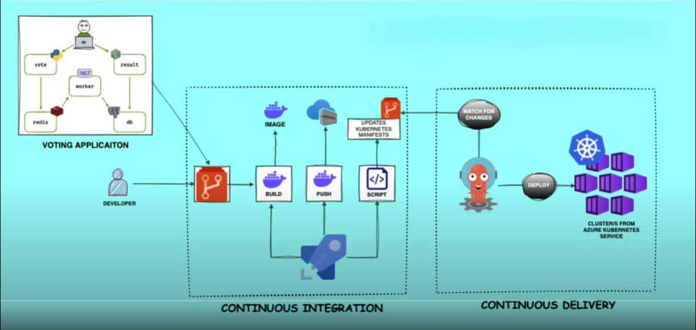
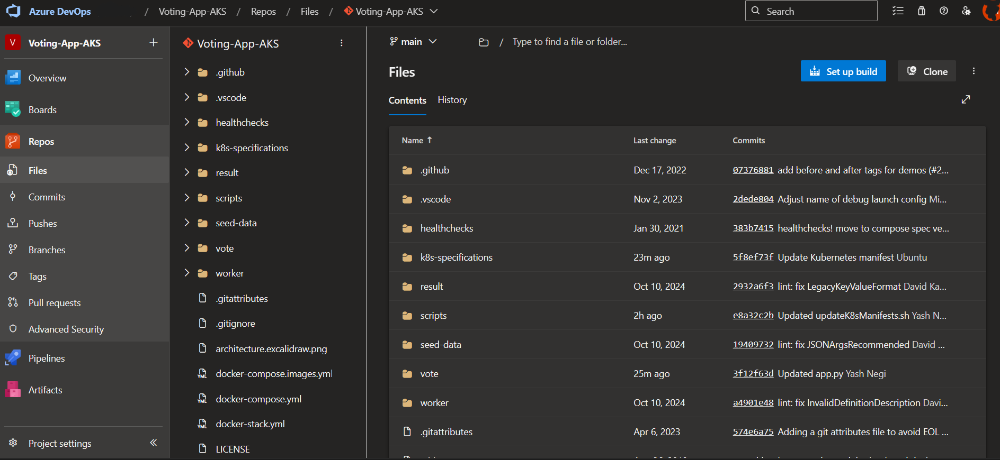
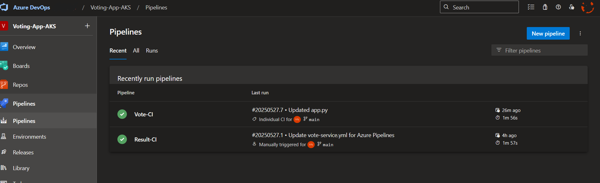
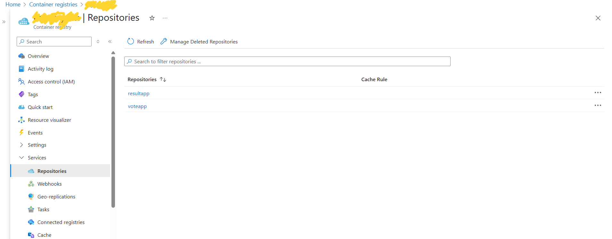
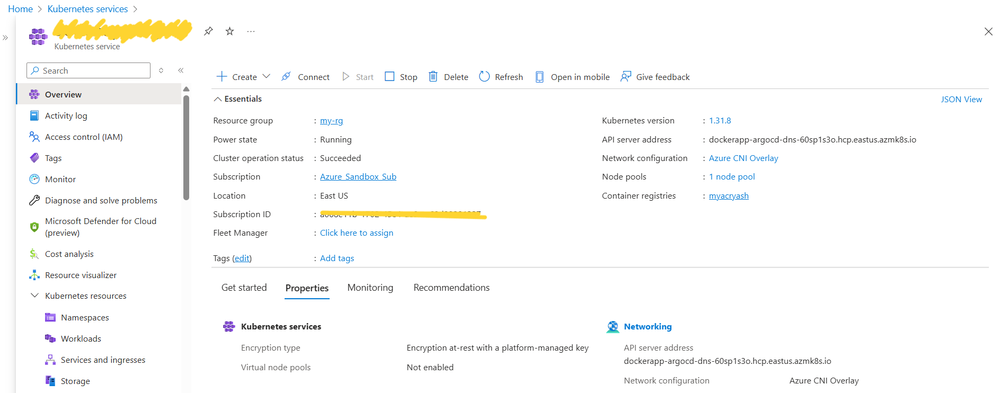
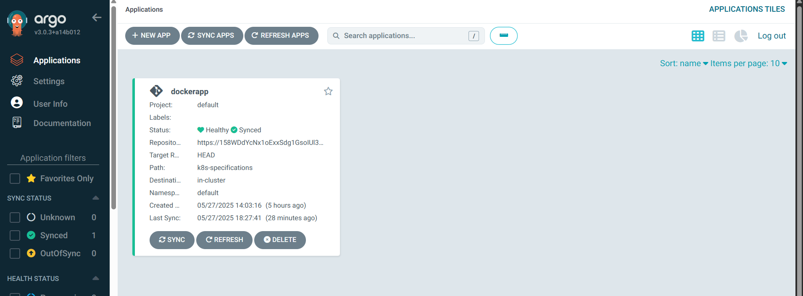
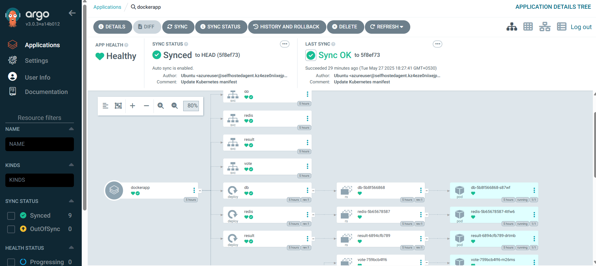
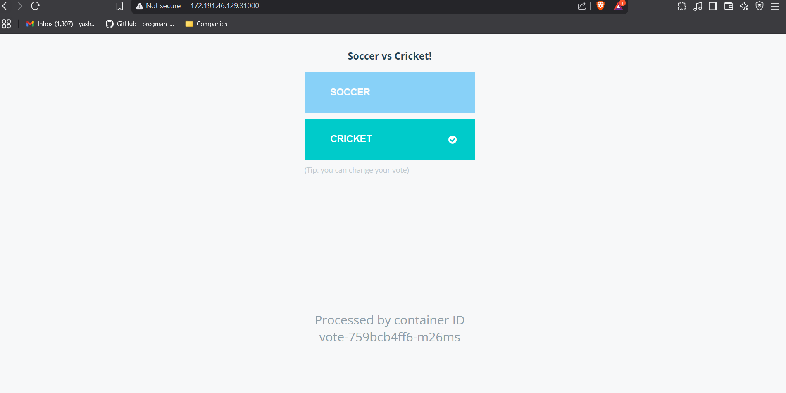
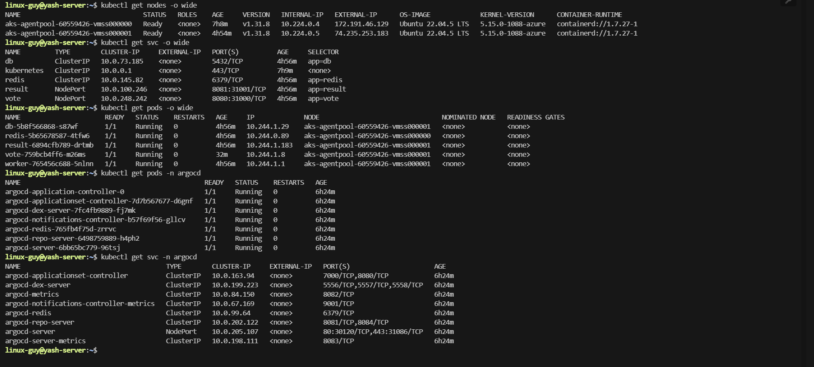

# 🚀 End-to-End CI/CD Pipeline with Azure DevOps, AKS & ArgoCD (GitOps Based)

This project demonstrates a complete CI/CD workflow for a microservices-based application deployed on Azure Kubernetes Service (AKS), using Azure DevOps for Continuous Integration and ArgoCD for GitOps-based Continuous Delivery.

---

## 📌 Project Overview

This is a 3-tier microservices application consisting of the following components:

- `vote`: A front-end Python web app for casting votes
- `redis`: A message queue that collects new votes
- `worker`: A .NET Core service that processes votes and stores them in the database
- `db`: A PostgreSQL database (with Docker volume persistence)
- `result`: A Node.js web app that displays voting results in real time

---

## 🛠️ Tools & Technologies Used

- **Azure DevOps** – Repos, Pipelines, and self-hosted agents
- **Azure Kubernetes Service (AKS)** – Managed Kubernetes cluster
- **Azure Container Registry (ACR)** – For Docker image storage
- **Docker** – Containerization of all microservices
- **ArgoCD** – GitOps tool for Kubernetes continuous delivery
- **Shell scripting** – For updating deployment manifests in CI pipeline
- **Git** – Source code and manifest version control

---

## 🧱 Architecture

A high-level overview of the CI/CD pipeline architecture:

---

## ⚙️ CI Workflow (Azure DevOps)

- Created self-hosted Linux agent for pipeline execution.
- Configured path-based triggers for microservice-specific pipelines.
- YAML pipelines include the following stages:

  - Build Docker image
  - Push image to ACR
  - Update Kubernetes manifest with latest image tag

## 🚀 CD Workflow (ArgoCD + GitOps)

- ArgoCD installed in the AKS cluster.
- Configured ArgoCD to continuously monitor a Git repo containing K8s manifests.
- On manifest change (new image tag), ArgoCD auto-syncs and deploys updated workloads to AKS.

## 📸 Screenshots

